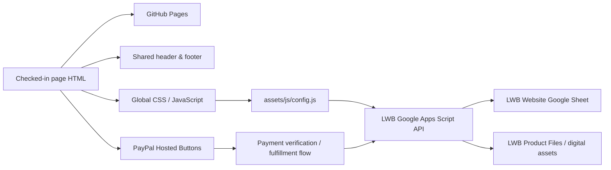

[Uploading README-v2.5.0.md…]()
[README-v2.5.0.md](README-v2.5.0.md)
<p align="center">
  <a href="https://www.livingwordbibles.com/">
    
  </a>
</p>

<h1 align="center">Living Word Bibles Website</h1>

<p align="center"><strong>Production Static Website &amp; Digital Bible Platform</strong></p>

<p align="center">
  <a href="https://github.com/Living-Word-Bibles/LWB-Website/actions/workflows/deploy-pages.yml"></a>
  
  
  
</p>

<p align="center">
  <a href="https://www.livingwordbibles.com/"><strong>www.livingwordbibles.com</strong></a>
  &nbsp;•&nbsp;
  <a href="https://github.com/Living-Word-Bibles/LWB-Website"><strong>GitHub Repository</strong></a>
</p>

<p align="center"><sub>© 2026 Living Word Bibles | All Rights Reserved | Developed by <a href="https://cts.cook-international.com">Cook Technology Services</a> in Chicago, Illinois | Last Updated on 30 August 2026 at 23:27:18Z UTC</sub></p>

---

## Production status

This repository is the production source for **Living Word Bibles** at **https://www.livingwordbibles.com/**.

The website uses a **plain static GitHub Pages architecture**. Checked-in page-level HTML files are the production source of truth. There is no generated `dist/` site, no `build.mjs`, and no site-generation step that rewrites page content before deployment.

A push to `main` validates the checked-in static tree and publishes the repository root directly to GitHub Pages.

### Current release metadata

| Component | Current value |
|---|---|
| Production site | `https://www.livingwordbibles.com/` |
| Deployment branch | `main` |
| Frontend package version | `2.5.0` |
| Google Apps Script API version | `3.0.0` |
| Apps Script build stamp | `27 August 2026 at 15:20:42Z UTC` |
| Runtime configuration architecture stamp | `2026-08-27T14:59:40Z` |
| Static-site architecture repair timestamp | `2026-08-27T22:28:20Z` |
| README revision | `30 August 2026 at 23:27:18Z UTC` |

> **Architecture rule:** page HTML is authoritative. Shared includes, runtime JavaScript, validation tooling, the Google Apps Script backend, and GitHub Actions support the site; none of them should regenerate or overwrite page bodies.
---

## What's New in v2.5.0

- Completed a **full public-route inventory** of the Living Word Bibles GitHub repository and the production website at `www.livingwordbibles.com`, with special attention to canonical content routes, redirect aliases, route families, search-oriented content, account/transaction utilities, and newer pages added during the v2.4.x release cycle.
- Rebuilt the production root **`sitemap.xml`** from the audited public route inventory instead of continuing to append URLs to the older sitemap.
- The new XML sitemap contains **307 unique canonical public URLs** intended for discovery.
- Confirmed and retained all **156 dedicated `/verses/` Bible-study pages**.
- Confirmed and retained all **66 `/history/books-of-the-bible/` book-history pages**.
- Confirmed the Bible Reader family and retained the `/read-the-bible-online/` landing page plus the current translation-reader routes for **KJV, NKJV, NIV, ESV, NET, LEB, ASV, YLT, WEB, OEB, DBY, GNV, BSB, BBE, DRB, NLT, and CSB**.
- Added `/bible-study/`, which had become a major public Scripture-study hub but was missing from the prior XML sitemap.
- Added the canonical **Common Prayers** library at `/prayers/` and all six dedicated prayer pages: the **Lord’s Prayer, Hail Mary, Serenity Prayer, Nicene Creed, Glory Be, and Guardian Angel Prayer**.
- Added the newer public pages `/editorial-standards/`, `/eeo/`, `/ethiopian-bible/`, and `/support/`, all of which were present in the current site/repository but absent from the previous sitemap.
- Retained the current canonical public eStore catalog: `/estore/` plus its six public eBible product pages.
- Retained the canonical translation-history pages, Catholic Bible resources, Living Word Bibles App page, Social Media page, About Us page, For Churches, donors, donation, legal/licensing pages, downloads, and HTML site-map route.
- Retained the canonical `/catholic-bible/wisdom` page and removed `/catholic-bible/wisdom-of-solomon` from the XML sitemap because that duplicate file explicitly declares `/catholic-bible/wisdom` as its canonical URL.
- Audited repository compatibility routes and intentionally kept redirect-only aliases out of the XML sitemap. Confirmed examples include `/home/ → /`, `/instagram/ → /social-media/`, `/twitter/ → /social-media/`, `/churches/ → /for-churches/`, `/bibles-1/ → /bibles/`, `/copyright/ → /copyright-notice/`, and `/the-holy-bible/ → /bibles/`.
- Removed authentication/account utility routes from the XML sitemap, including login, registration, password-reset/verification, account, library, orders, and profile pages. These routes remain functional website routes but are not canonical editorial/content destinations that need sitemap promotion.
- Removed transaction-completion/cancellation utility routes from the XML sitemap, including payment-complete, eStore order-complete, donation thank-you, and cancelled-order routes.
- Removed `/ads/` from sitemap promotion because it is an operational advertising/configuration utility rather than a substantive Living Word Bibles content page.
- Preserved `/opt-out/` with the public legal/privacy routes because it remains part of the public-facing privacy and preference framework.
- Kept `/bibles/drb/` and `/bibles/oeb/` because the repository gives those directory pages their own explicit canonical URLs rather than treating them as redirect aliases.
- Normalized the sitemap to one entry per canonical route and avoided adding `lastmod` values that could not be reliably derived per page from authoritative publication/revision metadata.
- Preserved the existing static GitHub Pages publishing model: `sitemap.xml` remains a checked-in root file and is published directly with the repository rather than generated by a build system.

### Inventory findings

| Route family | Canonical URLs retained |
|---|---:|
| Verse studies | 156 |
| Books of the Bible history pages | 66 |
| Bible Reader landing + translations | 18 |
| Catholic Bible book resources | 9 |
| Common Prayers landing + prayer pages | 7 |
| eStore landing + public eBible products | 7 |
| Bible directory pages (`/bibles`, DRB, OEB) | 3 |
| Translation-history pages | 17 |
| Other canonical public, legal, study, ministry, app, support, and site routes | 24 |
| **Total** | **307** |

### Sitemap policy established in v2.5.0

The production XML sitemap should list **canonical public content that Living Word Bibles wants search engines to discover**. A file being publicly reachable in a static GitHub Pages repository is not by itself sufficient reason to place the URL in `sitemap.xml`.

Redirect aliases, duplicate-canonical pages, authentication/account utilities, payment completion pages, cancellation/thank-you flows, and internal operational pages should remain outside the XML sitemap unless their purpose changes in a future release.

### Release safeguards

- No verse-study, Bible-book, translation-reader, prayer, product, or canonical content route was removed from the repository by this audit.
- No Google Apps Script backend code was changed.
- No PayPal Hosted Button IDs, checkout settings, fulfillment logic, account/session behavior, or runtime API configuration was changed.
- No redirect compatibility route was deleted; redirect aliases were simply excluded from sitemap promotion.
- v2.5.0 establishes a cleaner **repository/site inventory and search-discovery baseline** for future releases.

---

## What's New in v2.4.9

- Redesigned the **About Us** page at `/about-us/` and the **Social Media** page at `/social-media/` to bring both pages in line with the modern editorial presentation now used across Living Word Bibles.
- Preserved the site’s static GitHub Pages architecture, shared header/footer shell, existing routes, backend configuration, payment configuration, account/session behavior, and form wiring.

### About Us

- Rebuilt the About Us page from a largely linear legacy/Squarespace-style presentation into a modern responsive editorial layout.
- Preserved the existing shared-navigation anchor targets used by the About Us dropdown, including `#our-story`, `#our-team`, `#contact-us`, `#newsletter`, and `#frequently-asked-questions`.
- Preserved the existing `#support` anchor inside the FAQ/support content so direct support links continue to resolve.
- Replaced the previous top-page wording with the canonical Living Word Bibles slogan: **“Beautifully Formatted to Bring God’s Word to Life on Any Device.”**
- Reworked the About Us hero with a cleaner responsive layout, Living Word Bibles branding, mission-oriented calls to action, and stronger visual hierarchy.
- Added the existing repository asset `/assets/lwb_iphone_phone_only.webp` as the primary app/device visual in the hero so the mobile-reading experience is presented intentionally instead of forcing a landscape Bible photograph into the main feature slot.
- Retained the supporting About Us Bible photography while adjusting image presentation so supporting visuals remain properly cropped and proportioned.
- Added direct calls to action from the About hero for the **online Bible reader**, **Bible Study**, and **eStore**.
- Added a modern **Our Mission** section organized around three core presentation principles: **Accessible by Design**, **Reverent Presentation**, and **Scripture First**.
- Added the Living Word Bibles featured YouTube video (`ydGoRosM9tQ`) to the About Us page in a dedicated responsive 16:9 feature block.
- Modernized the **Our Team** presentation for Executive Director **Ms. Sophie Keller**, preserving the existing biography and team anchor while presenting the profile in a responsive leadership card.
- Added a new **Go Deeper with Living Word Bibles** section linking directly to **Read Scripture**, **Study the Bible**, and **History of the Bible**.
- Upgraded the three Go Deeper cards with public-domain image headers using the same visual approach introduced on the Bible Study and History pages.
- Added visible source/public-domain credit lines beneath the Go Deeper card imagery.
- Rebuilt **Contact Us** and **Newsletter** as coordinated responsive cards while preserving the existing contact information and `data-lwb-action="subscribe"` newsletter form behavior.
- Added a direct **Technical Support** call to action linking to `/support/`.
- Redesigned the FAQ presentation into a cleaner modern accordion while preserving all **22 existing FAQ entries**, their existing IDs, and the established accordion JavaScript hooks.
- Preserved existing order/support information, app information, translation information, third-party website notices, licensing guidance, and official Living Word Bibles purchase/support instructions.
- Preserved the existing `config.js`, `site.js`, and `forms.js` runtime dependencies.

### Social Media

- Rebuilt `/social-media/` from a minimal three-card social preview into a full Living Word Bibles social hub.
- Organized the page in the requested platform order: **YouTube first, Instagram second, X last**.
- Added a modern social hero with direct links and custom inline SVG platform icons for **YouTube**, **Instagram**, and **X**, avoiding an additional icon-library dependency.
- Added page-level anchor navigation for `#youtube`, `#instagram`, and `#x-posts`.
- Added the Living Word Bibles featured YouTube video (`ydGoRosM9tQ`) as the primary video feature at the top of the page.
- Added the official YouTube handle **@LivingWordBibles316** and a direct call to action to the Living Word Bibles YouTube channel.
- Added the official Instagram handle **@living.word.bibles**.
- Added **14 unique Instagram post URLs** supplied for the page and verified that no duplicate Instagram links were included.
- Implemented Instagram public-post embedding through the platform embed mechanism rather than copying or scraping post imagery.
- Added direct **Open on Instagram** fallback links for every Instagram post in case a browser’s privacy settings or third-party-script restrictions prevent an embed from rendering.
- Loaded the Instagram embed script only **once** for the page rather than once per post.
- Added the official X handle **@LBibles93286**.
- Added **7 unique X status IDs** supplied for the page and verified that no duplicate status IDs were included.
- Preserved the supplied X posts covering the Living Word Bibles App and Scripture posts including **1 John 2:25**, **John 1:5**, **Proverbs 3:5–6**, and **Romans 8:28**.
- Implemented the supplied X post collection using X/Twitter embed markup and loaded the X widgets script only **once** for the page rather than repeating it after each post.
- Added direct fallback links to the original X status pages so the social content remains reachable even when third-party embeds are blocked.
- Added responsive two-column desktop presentation for embedded social posts with a one-column mobile fallback.
- Preserved the canonical Social Media metadata, organization schema, shared global shell, and existing site JavaScript dependencies.

### Release safeguards

- No Google Apps Script backend behavior was changed.
- No PayPal Hosted Button IDs, merchant configuration, checkout behavior, fulfillment logic, or digital-product delivery settings were changed.
- No Living Word Bibles account/session logic was changed.
- No shared footer behavior was changed.
- Existing About Us navigation anchors were deliberately preserved even though the page content was substantially rearranged.
- The v2.4.9 release remains a **frontend/content presentation release**, so the version remains within the `2.4.x` line rather than advancing to `2.5.0`.

---

## What's New in v2.4.8

- Redesigned the **Christian Living** page at `/christian-living/` and the **Bible Study** page at `/bible-study/` so their video resources follow the same integrated editorial approach introduced on the History of the Bible page.
- Moved each page’s **Media Library** to the top of the content experience, immediately after the primary page introduction/navigation, so visitors can access a small set of key video resources without scrolling to the bottom of a long page.
- Reworked both page-level navigation menus so **Media Library** is a prominent top-level anchor while preserving the existing Scripture, prayer, devotional, books, and other major content anchors.

### Christian Living

- Rebuilt the Christian Living Media Library as a focused **three-video featured collection** at the top of the page rather than a long stack of embeds at the bottom.
- Retained **The Story of the Bible — From Beginning to End**, **John Chapter 1 — Summary and What God Wants From Us**, and **Amazing Grace — Judy Collins** as the three flagship Christian Living media resources.
- Preserved all **7 existing Christian Living YouTube resources**; no existing video was removed.
- Distributed the remaining four videos throughout the page according to subject matter so video becomes part of the devotional experience instead of a detached media dump.
- Integrated **God’s Word Changes Lives** beside the **Tools for Growth** material, reinforcing Scripture reading, memorization, study aids, and practical discipleship.
- Integrated **Trusting God in Difficult Times — Psalm 46 Meditation** directly with the **Faith in the Storm** devotional.
- Integrated **Love Jesus More Than You Love Anything** with the **A Servant’s Heart** / wholehearted-discipleship material.
- Integrated **Trusting God in Uncertainty** with **Hope That Endures**, connecting the video directly to the page’s treatment of faith, uncertainty, and enduring Christian hope.
- Added a consistent responsive video-feature presentation with contained cards, 16:9 embeds, contextual headings, explanatory copy, and spacing aligned with the visual treatment used on the History of the Bible page.
- Preserved **Most Popular Verses**, **Scripture Illustrated**, the expanded devotional content, and the existing `/prayers/` links introduced in earlier releases.
- Cleaned the **Glory Be** prayer block by removing stray template/placeholder text that did not belong on the Christian Living page while preserving the prayer itself.
- Retained the **Grow with Us** newsletter invitation as a dedicated closing callout instead of leaving it attached to the former bottom media dump.

### Bible Study

- Rebuilt the Bible Study Media Library as a focused **three-video featured collection** near the top of the page.
- Retained **Beginner’s Guide to Studying the Bible**, **Deep Bible Study — Connections Across Scripture**, and **Complete NIV Audio Bible — David Suchet** as the three key top-of-page media resources.
- Preserved all **11 existing Bible Study YouTube resources**; no existing video was removed.
- Distributed the remaining **8 videos** throughout the Bible Study page so they reinforce the section a visitor is actively studying.
- Added supporting study videos around **Featured Verse Studies** and the main **Verse-by-Verse Scripture Studies** library.
- Integrated a video resource with the **Prayer** section to connect Scripture study with prayerful response and worship.
- Integrated deeper-study and long-form resources into the **Books of the Bible** section, including the existing **Midweek Bible Study — The Book of Jude** resource as a concrete example of whole-book study.
- Integrated an additional study-series resource near the **Bible Reader** call to action to reinforce reading verses in literary and canonical context.
- Integrated the remaining long-form study resource with the closing **Scripture First / Our Approach** material, encouraging continued contextual study rather than isolated verse consumption.
- Preserved all **156 verse-study cards**, their dedicated `/verses/` routes, the public-domain card imagery added in v2.4.6, and the Featured Verse Studies presentation.
- Preserved the repaired **Bible Study search/filter system**, including normalized multi-term search, topic filtering, Old/New Testament filtering, result counts, and empty-result behavior.
- Preserved the six Common Prayer links, Books of the Bible links, Bible Reader links, and Editorial Standards link.
- Standardized responsive video presentation across Bible Study so featured media and in-context video callouts remain readable and properly proportioned on desktop, tablet, and mobile.

### Release safeguards

- Preserved the site’s plain static **GitHub Pages architecture** and page-level HTML source-of-truth model.
- No Google Apps Script backend, payment, PayPal Hosted Button, product, account/session, fulfillment, or runtime configuration behavior was changed in this release.
- No existing Christian Living or Bible Study video URL was intentionally removed; this release reorganizes and contextualizes the existing media library while tightening presentation and removing unrelated placeholder debris.

---

## What's New in v2.4.7

- Reorganized the **History of the Bible** page at `/history-of-the-bible/` into a more useful reference-first structure.
- Moved **Bible Translation Histories** and **The Books of the Holy Bible** directly beneath the page’s top anchor navigation so visitors can immediately browse translation histories or open the expanded studies for all 66 books before entering the long-form historical narrative.
- Added a prominent **Start Reading the History** control linking directly to `#from-scroll-to-screen`, giving readers a clear transition from the reference directories into the full historical narrative.
- Rebuilt the History page’s top navigation so the major destinations and integrated video resources are all directly accessible, including **Who Wrote the Bible**, **The Dead Sea Scrolls**, **King James Version**, **Bible Translation Histories**, **The Books of the Holy Bible**, and all three featured history videos.
- Repaired the previously nonfunctional **Who Wrote the Bible** navigation target by establishing the working `#who-wrote-the-bible` anchor while retaining compatibility with the earlier `#origins-and-authors` route.
- Preserved and repaired the existing **The Story of the Bible** and **Media Resources** legacy anchor behavior so existing links continue to resolve after the page reorganization.
- Added multiple **public-domain Bible and manuscript images** throughout the long-form history to break up the text and visually support the historical narrative.
- Used **CC0 Public Domain** Bible imagery from PublicDomainPictures.net where appropriate and historically specific public-domain manuscript imagery from Wikimedia Commons and institutional collections for sections such as the **Dead Sea Scrolls** and **Gutenberg Bible**.
- Added a visible **source and rights/credit line beneath each new History page image**, keeping image provenance and public-domain status clear to readers.
- Standardized History page image presentation with responsive sizing, consistent spacing, and manuscript-specific `object-fit: contain` handling so documentary images are not improperly cropped.
- Moved the three existing **YouTube history resources** out of the isolated media block at the bottom of the page and integrated each video into the historical section where it is most relevant.
- Integrated the **Who Wrote the Bible / History documentary** into the authorship and origins section.
- Integrated **The Complete Story of the Bible** alongside the canon and collection discussion.
- Integrated **The Dead Sea Scrolls** documentary directly into the Dead Sea Scrolls section.
- Updated the shared **History of the Bible** dropdown in `/assets/includes/lwb-header.html` using the current canonical header as the source, aligning the menu with the reorganized History page.
- Added direct History-dropdown links for **Start Reading the History**, **Bible Translation Histories**, **The Books of the Holy Bible**, **Who Wrote the Bible**, **The Story of the Bible**, **The Dead Sea Scrolls**, **King James Version**, and each of the three individual video resources.
- Preserved the existing **Books of the Catholic Bible** and **Maps of the Holy Land** links in the History dropdown.
- Verified that all internal History dropdown anchors resolve to actual targets on the updated History page.
- Refined the **eStore** paid-product presentation without changing the existing six-card product grid, product order, product artwork, product copy, pricing, or responsive layout.
- Corrected the visual spacing around the four PayPal-hosted paid products — **King James Version**, **American Standard Version**, **Young’s Literal Translation**, and **World English Bible** — by lifting their checkout/action areas slightly within the existing cards.
- Preserved the paired visual alignment of **King James Version / American Standard Version** and **Young’s Literal Translation / World English Bible** while reducing excessive empty space around the PayPal controls.
- Preserved all existing **PayPal Hosted Button IDs**, including `YXUZPMWTKME24`, `KBJTWT23LA6JN`, `5A5Z2VDH74DFG`, and `K7C2SJYLCDKMU`, together with all free-download links, product routes, prices, and fulfillment behavior.
- Preserved the static GitHub Pages architecture, shared shell, Google Apps Script API configuration, and all other production behavior outside the specific History navigation/content and eStore presentation changes described above.

---

## What's New in v2.4.6

- Updated the **Bible Study** page at `/bible-study/` to repair the Scripture-study search and filtering controls so users can reliably filter the 156 verse studies by reference, book, topic, and Old/New Testament.
- Hardened the Bible Study filtering logic so search terms, topic filters, and testament filters work together correctly, including normalized multi-word searches and proper empty-result/count behavior.
- Added **public-domain Bible-themed imagery** to the Bible Study verse cards and featured-study cards, using consistent responsive image sizing, a 16:9 crop, `object-fit: cover`, and lazy loading so the card grid remains visually consistent and performant.
- Updated the **Christian Living** page so **Most Popular Verses** and **Scripture Illustrated** link to the corresponding dedicated `/verses/` study pages wherever an existing verse page is available.
- Preserved the existing KJV Bible Reader links for **Luke 2:11** and **1 John 2:25**, which do not currently have dedicated `/verses/` study pages.
- Corrected **Psalms 23:4** to use the existing `/verses/psalms-23-4/` route and preserved the repository’s existing verse-route naming rather than normalizing or renaming published paths.
- Updated **Common Prayers** on Christian Living so each listed prayer links directly to its corresponding page under `/prayers/`, including the Lord’s Prayer, Hail Mary, Serenity Prayer, Nicene Creed, Glory Be, and Guardian Angel Prayer.
- Refined the new **Equal Opportunity & Workplace Policies** page at `/eeo/` after its initial v2.4.5 release, expanding the legal language and aligning the page more closely with the corporate EEO policy while preserving Living Word Bibles’ established legal-page design.
- Strengthened and clarified the **veterans and protected-veteran language and definitions** on the EEO page, retaining the dedicated veteran-policy coverage as a substantive part of the page.
- Removed redundant duplicate **EEO & Workplace Policies** content beneath the EEO banner and retained the consolidated legal-policy presentation.
- Updated the EEO contact-area presentation to use the established **legal banner treatment** used across other Living Word Bibles legal pages.
- Preserved the existing static-site architecture, shared header/footer includes, backend configuration, payment settings, and published verse/prayer routes; this release changes only the intended page content, navigation behavior, filtering behavior, and presentation described above.

---

## What's New in v2.4.5

- Added the new **Equal Opportunity & Workplace Policies** page at `/eeo/`.
- Updated the shared global footer to add an **EEO** link immediately after **Editorial Standards**, linking to `/eeo/`.

---

## What's New in v2.4.4

- Updated the **Terms of Service**, **Privacy Policy**, **Copyright Notice**, and **Publisher Licensing Notice** so **Cook Services Company, LLC** is a clickable hyperlink to `https://www.cook-international.com` in the operator attribution at the beginning and end of each legal page.
- Preserved the existing public contact email presentation near the top of the applicable legal pages while adding the Cook Services Company, LLC hyperlink.
- Updated the **Editorial Standards** page to use the same clickable **Cook Services Company, LLC** attribution linking to `https://www.cook-international.com`.

---

## What's New in v2.4.3

- Updated the **Ethiopian Bible** page so the **“What’s Included”** section sits in the left desktop column beneath the Living Word Bibles logo, to the left of the PayPal purchase button.

---

## What's New in v2.4.2

- Added `/assets/homepage-hero-4-mobile.png` as the mobile-specific version of the Living Word Bibles App homepage hero.
- Updated the homepage so the Living Word Bibles App hero uses `/assets/homepage-hero-4-mobile.png` on mobile only, while `/assets/homepage-hero-4.png` remains the desktop hero.

---

## What's New in v2.4.1

- Simplified the **homepage eBible merchandising section** so the homepage no longer duplicates the full paid eStore catalog.
- Retained the **Read God’s Word** homepage section with direct calls to action for the **Living Word Bibles eStore** and the **online Bible reader**.
- Removed the four paid eBible product cards from the homepage while preserving the complete six-edition catalog on `/estore/`.
- Kept the two free homepage editions — the **King James Version Special Edition** and the **Douay-Rheims Bible** — presented together as the featured free eBible downloads.
- Repositioned **Also Available From Trusted Booksellers** on the homepage above the two free eBible cards.
- Retained **Amazon** and **Barnes & Noble** as the trusted-bookseller links and adjusted the Barnes & Noble logo sizing so its visual weight better matches the Amazon logo.
- Added the same **Also Available From Trusted Booksellers** presentation to `/estore/`, positioned between the eStore introduction and the six-product digital Bible catalog.
- Preserved all existing **free-download URLs, paid-product PayPal Hosted Button IDs, product routes, prices, and fulfillment behavior**; this release changes presentation only.
- Preserved the static-site architecture and shared global shell introduced in v2.4.0.

---

## What's New in v2.4.0

- Hardened the **global header/footer shell** to resolve the navigation dropdown bug and keep shared navigation reliably above homepage hero content and other page-level layers.
- Fixed **desktop and mobile dropdown behavior**, including stacking, overflow, responsive menu flow, and viewport-safe scrolling for expanded mobile navigation.
- Added `/assets/homepage-hero-4.png` as the new **Living Word Bibles App homepage hero**, positioned in the homepage carousel between the primary Living Word Bibles hero and the Ethiopian Bible hero.
- Added the new **homepage mobile app hero presentation** for improved app promotion and responsive display.
- Improved the **global header/footer mobile behavior** so branding, Help, App, Menu, navigation groups, and dropdowns remain usable on smaller screens.
- Added a custom **mobile-only HTML/CSS iPhone + “iOS” badge** in the global header while preserving the existing desktop app badge.
- Added **authenticated header presentation**: when a valid Living Word Bibles account session is present, the `Login` control can display a custom user icon and the customer’s first name and link directly to `/account/`.
- Preserved the existing **Google Apps Script account backend and session architecture**; the v2.4.0 header changes consume the existing account/session system rather than replacing it.
- Preserved the static-site architecture: page-level HTML remains authoritative, and shared shell/runtime changes do not regenerate or overwrite page content.

---

## What's New in v2.3.0

- Added the new **Bible Study** landing page at `/bible-study/`.
- Expanded all **156 entries in the Verses Directory** to robust **750–1,000 word Bible-study summaries**.
- Embedded the **legacy KJV reader** on all 156 verse-study pages so each passage loads directly in context.
- Added **Common Prayers** under `/prayers/`, with dedicated prayer pages containing **500–750 word summaries**.
- Updated the **global header shell** to include the new **Bible Study** navigation section.

---

## What's New in v2.2.0

- Updated the global header to include **Media Resources** in the History dropdown.
- Expanded the **Books of the Bible** history pages to approximately **1,200 words or more**.
- Updated the **global header/footer shell**.

---

## What's New in v2.1.0

- Updated **PayPal links** to provide direct product-download access while preserving the payment-confirmation workflow.
- Added **Editorial Standards**.
- Updated the **global header/footer shell**.

---
## Architecture at a glance



The public website and the operational backend are deliberately separated:

- **GitHub Pages** serves the checked-in website files.
- **Google Apps Script** provides data/API functions and digital fulfillment support.
- **Google Sheets** stores structured operational data.
- **Google Drive and repository assets** provide digital product files as configured.
- **PayPal Hosted Buttons** remain the checkout layer for paid products and donations.

---

## Site architecture

| Path | Responsibility |
|---|---|
| `index.html` and page-level `*/index.html` files | Authoritative production content |
| `assets/includes/lwb-header.html` | Canonical global header and navigation |
| `assets/includes/lwb-footer.html` | Canonical global footer, contact, and newsletter block |
| `assets/css/site.css` | Global website styling |
| `assets/js/site.js` | Shared-shell loading, navigation, and global site behavior |
| `assets/js/config.js` | Single public runtime configuration point for backend URL and contact email |
| `assets/js/forms.js` | Public form behavior |
| `assets/js/products.js` | Product and PayPal-related front-end behavior |
| `apps-script/Code.gs` | Source-controlled Google Apps Script backend |
| `scripts/validate-links.mjs` | Static route, anchor, and asset validation only |
| `.github/workflows/deploy-pages.yml` | Validation and GitHub Pages deployment |
| `PUBLIC-PAGE-REGISTRY.json` | Public route registry |
| `sitemap.xml` | Search-engine sitemap |
| `404.html` | Branded static 404 page |
| `CNAME` | Production custom-domain configuration |

Major content areas include Bible translation pages, online Bible readers, Catholic Bible/deuterocanonical resources, Bible history, Holy Land maps, eStore pages, the Ethiopian Bible page, account routes, support/legal pages, the Equal Opportunity & Workplace Policies page, donation pages, social pages, and the Living Word Bibles app page. Homepage promotional assets include the rotating hero series under `/assets/`, including the desktop app hero at `/assets/homepage-hero-4.png` and its mobile-specific companion at `/assets/homepage-hero-4-mobile.png`.

---

## Editing production pages

Edit the relevant checked-in HTML file directly. A deployment does not rebuild page bodies, so a content edit remains exactly as committed.

Pages should use the shared shell rather than duplicating navigation or footer markup:

```html
<div data-lwb-header></div>
...
<div data-lwb-footer></div>
```

`assets/js/site.js` loads those shared fragments at runtime.

### Do not

- Do not recreate a `dist/` production tree.
- Do not reintroduce `scripts/build.mjs` as a page generator.
- Do not add an `npm run build` step that rewrites HTML.
- Do not maintain competing hard-coded copies of the universal header or footer.
- Do not hard-code the Apps Script Web App URL across individual pages.
- Do not change PayPal merchant/receiver settings as part of an unrelated website edit.
- Do not commit private PayPal credentials, download-signing secrets, or other server-side secrets.

---

## Shared header and footer

The universal site shell is maintained in exactly two canonical fragments:

```text
/assets/includes/lwb-header.html
/assets/includes/lwb-footer.html
```

Page files contain placeholders only. This keeps navigation, authenticated account/login presentation, site identity, responsive mobile header behavior, contact details, newsletter UI, and footer content consistent across the production site. The shared header is also responsible for the hardened dropdown stacking/overflow behavior and the mobile-only HTML/CSS iOS badge introduced in v2.4.0.

---

## Runtime configuration

`assets/js/config.js` is the single public runtime configuration file:

```js
window.LWB_SITE_CONFIG = Object.freeze({
  apiBase: "https://script.google.com/macros/s/AKfycbwHIonCe2_aijuiflRSq1jtXMpueX6DCoVIssW-YRqWT3gDisH13g1UzJrhnY1KteM1/exec",
  contactEmail: "gospellivingwordbibles@gmail.com",
  lastArchitectureUpdateUtc: "2026-08-27T14:59:40Z"
});
```

Individual pages should not contain alternate backend deployment URLs.

---

## Public contact

The canonical public Living Word Bibles contact address is:

```text
gospellivingwordbibles@gmail.com
```

The public contact address is separate from PayPal merchant/receiver configuration. Updating website contact information does **not** authorize changing a PayPal receiver email or other payment credentials.

---

## Google Apps Script backend

The source-controlled backend lives at:

```text
/apps-script/Code.gs
```

The current source reports:

```text
Service: LWB Website API
Version: 3.0.0
Apps Script build stamp: 27 August 2026 at 15:20:42Z UTC
```

The backend is a **data/API service only**. It does not create, regenerate, or overwrite website HTML.

### Backend resources

| Resource | Value |
|---|---|
| Google Sheet | `LWB Website` |
| Spreadsheet ID | `1xnzdo1UJsEOTqcO2066Nfb6ayqKn8Zg5RbNLdpbaTcc` |
| Product folder | `LWB Product Files` |
| Product folder ID | `1G6H26CknI1XI090cMVVjb8aVYxM94APP` |
| Apps Script Web App | `LWB Backend` |
| Web App URL | `https://script.google.com/macros/s/AKfycbwHIonCe2_aijuiflRSq1jtXMpueX6DCoVIssW-YRqWT3gDisH13g1UzJrhnY1KteM1/exec` |

### Current public API actions

**GET**

- `?action=ping`
- `?action=health`
- `?action=settings`
- `?action=products`
- `?action=product&slug=...`
- `?action=social`
- `?action=free-download-link&product=...`
- `?action=verify-pdt&tx=...&product=...`
- `?action=download&token=...`

**POST**

- `subscribe`
- `unsubscribe`
- `contact`
- `free-download`

### Backend data model

The Apps Script source references these operational sheets:

- `Settings`
- `Products`
- `Product Features`
- `Product Images`
- `Digital Assets`
- `Customers`
- `Orders`
- `Order Items`
- `Entitlements`
- `Download Log`
- `Newsletter Subscribers`
- `Audience Memberships`
- `Do Not Email`
- `Contact Messages`
- `Newsletter Campaigns`
- `Social Posts`
- `System Log`

Server-side secrets such as `DOWNLOAD_TOKEN_SECRET` belong in Apps Script Properties and must never be committed to this repository.

---

## Digital Bible catalog and PayPal

The core eStore currently presents six digital Bible editions: two free editions and four PayPal-purchased editions. The Ethiopian Bible PDF is offered through its own dedicated product page.

### eBible products

| Product | Route / delivery | Price model | Hosted Button ID |
|---|---|---:|---|
| KJV Special Edition | `/estore/p/the-holy-bible-king-james-version-special-edition/` | Free | — |
| King James Version | `/estore/p/the-holy-bible-king-james-version/` | Paid | `YXUZPMWTKME24` |
| American Standard Version | `/estore/p/the-holy-bible-american-standard-version-asv/` | Paid | `KBJTWT23LA6JN` |
| Young's Literal Translation | `/estore/p/the-holy-bible-youngs-literal-translation-ylt/` | Paid | `5A5Z2VDH74DFG` |
| World English Bible | `/estore/p/the-holy-bible-world-english-bible-web/` | Paid | `K7C2SJYLCDKMU` |
| Douay-Rheims Bible | `/estore/p/the-holy-bible-douay-rheims-bible/` | Free | — |
| Complete Apocrypha of the Ethiopian Bible | `/ethiopian-bible/` | Paid PDF | `8Z63ZMZEALLG4` |

Free repository-backed EPUB assets currently include:

```text
/assets/products/kjvspecial.epub
/assets/products/drb.epub
```

### Other PayPal Hosted Buttons

| Purpose | Hosted Button ID |
|---|---|
| LWB Bible App | `4HCP6WRVGQNV2` |
| Donate | `QQDSDMS4D9FC4` |

PayPal Hosted Button IDs and the PayPal client configuration are production payment settings. Preserve them unless a payment change is intentional and separately verified.

See `PAYPAL-AND-FULFILLMENT-SETUP.md` before modifying payment or fulfillment behavior.

---

## Validation — not a build

The Node package is used for validation only.

### Requirements

- Local package engine: **Node.js 20 or newer**
- GitHub Actions validation runtime: **Node.js 24**

### Commands

```bash
npm ci
npm run validate
```

`npm run audit` is currently an alias for the same validator:

```bash
npm run audit
```

There is intentionally **no `npm run build` command**.

`scripts/validate-links.mjs` validates the static repository tree and may refresh validation reports. It does not generate or replace production page HTML.

---

## Deployment

Deployment is handled by `.github/workflows/deploy-pages.yml`.

A push to `main` triggers the following pipeline:

1. Check out the repository.
2. Set up Node.js 24.
3. Run `npm ci`.
4. Run `npm run validate`.
5. Verify critical static entry files.
6. Configure GitHub Pages.
7. Upload the **repository root (`.`)** as the Pages artifact.
8. Publish the artifact to the `github-pages` environment.

The deployment workflow explicitly verifies:

```text
index.html
404.html
CNAME
sitemap.xml
assets/includes/lwb-header.html
assets/includes/lwb-footer.html
assets/js/config.js
```

There is no generated output directory.

For operational details, see:

- `BUILD-AND-DEPLOYMENT.md`
- `DEPLOYMENT-CHECKLIST.md`
- `LINK-VALIDATION-REPORT.md`
- `MISSING-ASSETS.md`
- `MISSING-CREDENTIALS.md`
- `PAGE-ROUTE-INVENTORY.md`
- `READER-DIAGNOSTIC-REPORT.md`
- `WORKBOOK-SCHEMA.md`

---

## GitHub Pages production model

The production model is intentionally simple:

```text
Edit checked-in HTML
        ↓
Commit / push to main
        ↓
GitHub Actions validation
        ↓
Upload repository root
        ↓
GitHub Pages deployment
        ↓
www.livingwordbibles.com
```

If a checked-in page is correct, the deployment process should publish that exact page rather than regenerate it from another source.

---

## Legal-page revision dates

Visible `Last Updated` and `Last Revised` labels are maintained only on legal or licensing pages that already display such a label.

The established visible date format is:

```text
27 August 2026
```

Machine-readable dates may use ISO format, for example:

```html
<time datetime="2026-08-27">27 August 2026</time>
```

Ordinary content pages should not receive visible revision labels solely because the repository README or site architecture changes.

---

## 27 August 2026 static-site architecture repair

The production architecture was repaired and simplified on 27 August 2026:

- Removed generated `dist/` output from the production model.
- Removed `scripts/build.mjs` and the page-generation source tree.
- Made checked-in page-level HTML authoritative.
- Retained one canonical universal header and footer under `assets/includes/`.
- Connected the site to `LWB Backend` through one `assets/js/config.js` file.
- Migrated legacy public-contact references to `gospellivingwordbibles@gmail.com`.
- Preserved PayPal Hosted Button IDs, client configuration, and payment flow.
- Standardized visible legal/licensing revision labels where applicable.
- Configured GitHub Pages to publish the checked-in repository root directly.

Historical architecture repair timestamp:

```text
2026-08-27T22:28:20Z
```

---

## Operational safeguards

Before merging a production change:

- Validate the site locally with `npm run validate`.
- Confirm that universal navigation changes are made in the shared include, not duplicated across pages.
- Confirm that `assets/js/config.js` remains the only public backend URL configuration point.
- Confirm that payment-related edits preserve the correct Hosted Button IDs.
- Confirm that private Apps Script properties and PayPal credentials remain outside source control.
- Confirm that free product assets still resolve and paid fulfillment remains protected as designed.
- Review any changed legal-page revision date independently from the README revision date.
- Push only the files intentionally changed.

---

## Repository identity

**Living Word Bibles** develops and publishes Bible reading resources, translation histories, Catholic Bible resources, digital Bible editions, and related study material for the web and supported devices.

- **Production:** https://www.livingwordbibles.com/
- **Public email:** gospellivingwordbibles@gmail.com
- **Repository:** https://github.com/Living-Word-Bibles/LWB-Website
- **Developer:** https://cts.cook-international.com

---

**Repository architecture revision:** `2026-08-27T22:28:20Z`  
**Apps Script build stamp:** `27 August 2026 at 15:20:42Z UTC`  
**Backend API version:** `3.0.0`  
**README last updated:** **30 August 2026 at 23:27:18Z UTC**

---

<p align="center"><strong>© 2026 Living Word Bibles | All Rights Reserved | Developed by <a href="https://cts.cook-international.com">Cook Technology Services</a> in Chicago, Illinois | Last Updated on 30 August 2026 at 23:27:18Z UTC</strong></p>
