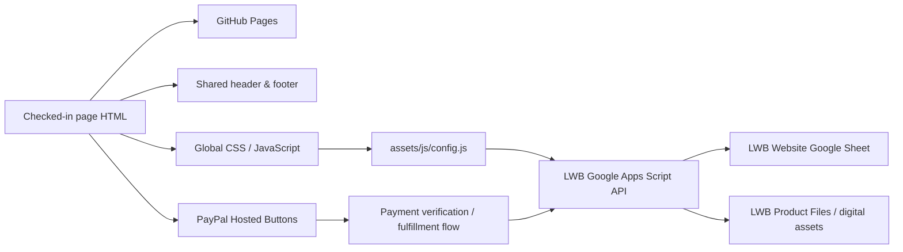

[README.md](https://github.com/user-attachments/files/31572992/README.md)
<p align="center">
  <a href="https://www.livingwordbibles.com/">
    
  </a>
</p>

<h1 align="center">Living Word Bibles Website</h1>

<p align="center"><strong>Production Static Website &amp; Digital Bible Platform</strong></p>

<p align="center">
  <a href="https://github.com/Living-Word-Bibles/LWB-Website/actions/workflows/deploy-pages.yml"></a>
  
  
  
</p>

<p align="center">
  <a href="https://www.livingwordbibles.com/"><strong>www.livingwordbibles.com</strong></a>
  &nbsp;•&nbsp;
  <a href="https://github.com/Living-Word-Bibles/LWB-Website"><strong>GitHub Repository</strong></a>
</p>

<p align="center"><sub>© 2026 Living Word Bibles | All Rights Reserved | Developed by <a href="https://cts.cook-international.com">Cook Technology Services</a> in Chicago, Illinois | Last Updated on 28 August 2026 at 22:20:00Z UTC</sub></p>

---

## Production status

This repository is the production source for **Living Word Bibles** at **https://www.livingwordbibles.com/**.

The website uses a **plain static GitHub Pages architecture**. Checked-in page-level HTML files are the production source of truth. There is no generated `dist/` site, no `build.mjs`, and no site-generation step that rewrites page content before deployment.

A push to `main` validates the checked-in static tree and publishes the repository root directly to GitHub Pages.

### Current release metadata

| Component | Current value |
|---|---|
| Production site | `https://www.livingwordbibles.com/` |
| Deployment branch | `main` |
| Frontend package version | `2.1.0` |
| Google Apps Script API version | `3.0.0` |
| Apps Script build stamp | `27 August 2026 at 15:20:42Z UTC` |
| Runtime configuration architecture stamp | `2026-08-27T14:59:40Z` |
| Static-site architecture repair timestamp | `2026-08-27T22:28:20Z` |
| README revision | `28 August 2026 at 22:20:00Z UTC` |

> **Architecture rule:** page HTML is authoritative. Shared includes, runtime JavaScript, validation tooling, the Google Apps Script backend, and GitHub Actions support the site; none of them should regenerate or overwrite page bodies.

---
## v2.1 Release Note(s):
v2.1 now includes
• Updated PayPal link(s) for direct product download.  
• Added Editorial Standard(s)
• Updated Global Header/Footer shell
---
## Architecture at a glance



The public website and the operational backend are deliberately separated:

- **GitHub Pages** serves the checked-in website files.
- **Google Apps Script** provides data/API functions and digital fulfillment support.
- **Google Sheets** stores structured operational data.
- **Google Drive and repository assets** provide digital product files as configured.
- **PayPal Hosted Buttons** remain the checkout layer for paid products and donations.

---

## Site architecture

| Path | Responsibility |
|---|---|
| `index.html` and page-level `*/index.html` files | Authoritative production content |
| `assets/includes/lwb-header.html` | Canonical global header and navigation |
| `assets/includes/lwb-footer.html` | Canonical global footer, contact, and newsletter block |
| `assets/css/site.css` | Global website styling |
| `assets/js/site.js` | Shared-shell loading, navigation, and global site behavior |
| `assets/js/config.js` | Single public runtime configuration point for backend URL and contact email |
| `assets/js/forms.js` | Public form behavior |
| `assets/js/products.js` | Product and PayPal-related front-end behavior |
| `apps-script/Code.gs` | Source-controlled Google Apps Script backend |
| `scripts/validate-links.mjs` | Static route, anchor, and asset validation only |
| `.github/workflows/deploy-pages.yml` | Validation and GitHub Pages deployment |
| `PUBLIC-PAGE-REGISTRY.json` | Public route registry |
| `sitemap.xml` | Search-engine sitemap |
| `404.html` | Branded static 404 page |
| `CNAME` | Production custom-domain configuration |

Major content areas include Bible translation pages, online Bible readers, Catholic Bible/deuterocanonical resources, Bible history, Holy Land maps, eStore pages, the Ethiopian Bible page, account routes, support/legal pages, donation pages, social pages, and the Living Word Bibles app page.

---

## Editing production pages

Edit the relevant checked-in HTML file directly. A deployment does not rebuild page bodies, so a content edit remains exactly as committed.

Pages should use the shared shell rather than duplicating navigation or footer markup:

```html
<div data-lwb-header></div>
...
<div data-lwb-footer></div>
```

`assets/js/site.js` loads those shared fragments at runtime.

### Do not

- Do not recreate a `dist/` production tree.
- Do not reintroduce `scripts/build.mjs` as a page generator.
- Do not add an `npm run build` step that rewrites HTML.
- Do not maintain competing hard-coded copies of the universal header or footer.
- Do not hard-code the Apps Script Web App URL across individual pages.
- Do not change PayPal merchant/receiver settings as part of an unrelated website edit.
- Do not commit private PayPal credentials, download-signing secrets, or other server-side secrets.

---

## Shared header and footer

The universal site shell is maintained in exactly two canonical fragments:

```text
/assets/includes/lwb-header.html
/assets/includes/lwb-footer.html
```

Page files contain placeholders only. This keeps navigation, account/login presentation, site identity, contact details, newsletter UI, and footer content consistent across the production site.

---

## Runtime configuration

`assets/js/config.js` is the single public runtime configuration file:

```js
window.LWB_SITE_CONFIG = Object.freeze({
  apiBase: "https://script.google.com/macros/s/AKfycbwHIonCe2_aijuiflRSq1jtXMpueX6DCoVIssW-YRqWT3gDisH13g1UzJrhnY1KteM1/exec",
  contactEmail: "gospellivingwordbibles@gmail.com",
  lastArchitectureUpdateUtc: "2026-08-27T14:59:40Z"
});
```

Individual pages should not contain alternate backend deployment URLs.

---

## Public contact

The canonical public Living Word Bibles contact address is:

```text
gospellivingwordbibles@gmail.com
```

The public contact address is separate from PayPal merchant/receiver configuration. Updating website contact information does **not** authorize changing a PayPal receiver email or other payment credentials.

---

## Google Apps Script backend

The source-controlled backend lives at:

```text
/apps-script/Code.gs
```

The current source reports:

```text
Service: LWB Website API
Version: 3.0.0
Apps Script build stamp: 27 August 2026 at 15:20:42Z UTC
```

The backend is a **data/API service only**. It does not create, regenerate, or overwrite website HTML.

### Backend resources

| Resource | Value |
|---|---|
| Google Sheet | `LWB Website` |
| Spreadsheet ID | `1xnzdo1UJsEOTqcO2066Nfb6ayqKn8Zg5RbNLdpbaTcc` |
| Product folder | `LWB Product Files` |
| Product folder ID | `1G6H26CknI1XI090cMVVjb8aVYxM94APP` |
| Apps Script Web App | `LWB Backend` |
| Web App URL | `https://script.google.com/macros/s/AKfycbwHIonCe2_aijuiflRSq1jtXMpueX6DCoVIssW-YRqWT3gDisH13g1UzJrhnY1KteM1/exec` |

### Current public API actions

**GET**

- `?action=ping`
- `?action=health`
- `?action=settings`
- `?action=products`
- `?action=product&slug=...`
- `?action=social`
- `?action=free-download-link&product=...`
- `?action=verify-pdt&tx=...&product=...`
- `?action=download&token=...`

**POST**

- `subscribe`
- `unsubscribe`
- `contact`
- `free-download`

### Backend data model

The Apps Script source references these operational sheets:

- `Settings`
- `Products`
- `Product Features`
- `Product Images`
- `Digital Assets`
- `Customers`
- `Orders`
- `Order Items`
- `Entitlements`
- `Download Log`
- `Newsletter Subscribers`
- `Audience Memberships`
- `Do Not Email`
- `Contact Messages`
- `Newsletter Campaigns`
- `Social Posts`
- `System Log`

Server-side secrets such as `DOWNLOAD_TOKEN_SECRET` belong in Apps Script Properties and must never be committed to this repository.

---

## Digital Bible catalog and PayPal

The core eStore currently presents six digital Bible editions: two free editions and four PayPal-purchased editions. The Ethiopian Bible PDF is offered through its own dedicated product page.

### eBible products

| Product | Route / delivery | Price model | Hosted Button ID |
|---|---|---:|---|
| KJV Special Edition | `/estore/p/the-holy-bible-king-james-version-special-edition/` | Free | — |
| King James Version | `/estore/p/the-holy-bible-king-james-version/` | Paid | `YXUZPMWTKME24` |
| American Standard Version | `/estore/p/the-holy-bible-american-standard-version-asv/` | Paid | `KBJTWT23LA6JN` |
| Young's Literal Translation | `/estore/p/the-holy-bible-youngs-literal-translation-ylt/` | Paid | `5A5Z2VDH74DFG` |
| World English Bible | `/estore/p/the-holy-bible-world-english-bible-web/` | Paid | `K7C2SJYLCDKMU` |
| Douay-Rheims Bible | `/estore/p/the-holy-bible-douay-rheims-bible/` | Free | — |
| Complete Apocrypha of the Ethiopian Bible | `/ethiopian-bible/` | Paid PDF | `8Z63ZMZEALLG4` |

Free repository-backed EPUB assets currently include:

```text
/assets/products/kjvspecial.epub
/assets/products/drb.epub
```

### Other PayPal Hosted Buttons

| Purpose | Hosted Button ID |
|---|---|
| LWB Bible App | `4HCP6WRVGQNV2` |
| Donate | `QQDSDMS4D9FC4` |

PayPal Hosted Button IDs and the PayPal client configuration are production payment settings. Preserve them unless a payment change is intentional and separately verified.

See `PAYPAL-AND-FULFILLMENT-SETUP.md` before modifying payment or fulfillment behavior.

---

## Validation — not a build

The Node package is used for validation only.

### Requirements

- Local package engine: **Node.js 20 or newer**
- GitHub Actions validation runtime: **Node.js 24**

### Commands

```bash
npm ci
npm run validate
```

`npm run audit` is currently an alias for the same validator:

```bash
npm run audit
```

There is intentionally **no `npm run build` command**.

`scripts/validate-links.mjs` validates the static repository tree and may refresh validation reports. It does not generate or replace production page HTML.

---

## Deployment

Deployment is handled by `.github/workflows/deploy-pages.yml`.

A push to `main` triggers the following pipeline:

1. Check out the repository.
2. Set up Node.js 24.
3. Run `npm ci`.
4. Run `npm run validate`.
5. Verify critical static entry files.
6. Configure GitHub Pages.
7. Upload the **repository root (`.`)** as the Pages artifact.
8. Publish the artifact to the `github-pages` environment.

The deployment workflow explicitly verifies:

```text
index.html
404.html
CNAME
sitemap.xml
assets/includes/lwb-header.html
assets/includes/lwb-footer.html
assets/js/config.js
```

There is no generated output directory.

For operational details, see:

- `BUILD-AND-DEPLOYMENT.md`
- `DEPLOYMENT-CHECKLIST.md`
- `LINK-VALIDATION-REPORT.md`
- `MISSING-ASSETS.md`
- `MISSING-CREDENTIALS.md`
- `PAGE-ROUTE-INVENTORY.md`
- `READER-DIAGNOSTIC-REPORT.md`
- `WORKBOOK-SCHEMA.md`

---

## GitHub Pages production model

The production model is intentionally simple:

```text
Edit checked-in HTML
        ↓
Commit / push to main
        ↓
GitHub Actions validation
        ↓
Upload repository root
        ↓
GitHub Pages deployment
        ↓
www.livingwordbibles.com
```

If a checked-in page is correct, the deployment process should publish that exact page rather than regenerate it from another source.

---

## Legal-page revision dates

Visible `Last Updated` and `Last Revised` labels are maintained only on legal or licensing pages that already display such a label.

The established visible date format is:

```text
27 August 2026
```

Machine-readable dates may use ISO format, for example:

```html
<time datetime="2026-08-27">27 August 2026</time>
```

Ordinary content pages should not receive visible revision labels solely because the repository README or site architecture changes.

---

## 27 August 2026 static-site architecture repair

The production architecture was repaired and simplified on 27 August 2026:

- Removed generated `dist/` output from the production model.
- Removed `scripts/build.mjs` and the page-generation source tree.
- Made checked-in page-level HTML authoritative.
- Retained one canonical universal header and footer under `assets/includes/`.
- Connected the site to `LWB Backend` through one `assets/js/config.js` file.
- Migrated legacy public-contact references to `gospellivingwordbibles@gmail.com`.
- Preserved PayPal Hosted Button IDs, client configuration, and payment flow.
- Standardized visible legal/licensing revision labels where applicable.
- Configured GitHub Pages to publish the checked-in repository root directly.

Historical architecture repair timestamp:

```text
2026-08-27T22:28:20Z
```

---

## Operational safeguards

Before merging a production change:

- Validate the site locally with `npm run validate`.
- Confirm that universal navigation changes are made in the shared include, not duplicated across pages.
- Confirm that `assets/js/config.js` remains the only public backend URL configuration point.
- Confirm that payment-related edits preserve the correct Hosted Button IDs.
- Confirm that private Apps Script properties and PayPal credentials remain outside source control.
- Confirm that free product assets still resolve and paid fulfillment remains protected as designed.
- Review any changed legal-page revision date independently from the README revision date.
- Push only the files intentionally changed.

---

## Repository identity

**Living Word Bibles** develops and publishes Bible reading resources, translation histories, Catholic Bible resources, digital Bible editions, and related study material for the web and supported devices.

- **Production:** https://www.livingwordbibles.com/
- **Public email:** gospellivingwordbibles@gmail.com
- **Repository:** https://github.com/Living-Word-Bibles/LWB-Website
- **Developer:** https://cts.cook-international.com

---

**Repository architecture revision:** `2026-08-27T22:28:20Z`  
**Apps Script build stamp:** `27 August 2026 at 15:20:42Z UTC`  
**Backend API version:** `3.0.0`  
**README last updated:** **28 August 2026 at 22:20:00Z UTC**

---

<p align="center"><strong>© 2026 Living Word Bibles | All Rights Reserved | Developed by <a href="https://cts.cook-international.com">Cook Technology Services</a> in Chicago, Illinois | Last Updated on 28 August 2026 at 22:20:00Z UTC</strong></p>
