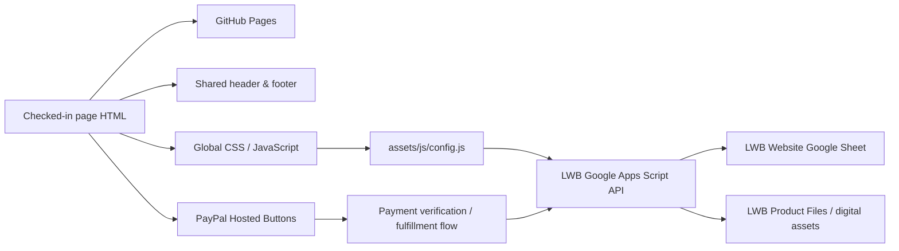

[README-v2.5.4.md](https://github.com/user-attachments/files/31690737/README-v2.5.4.md)
<p align="center">
  <a href="https://www.livingwordbibles.com/">
    
  </a>
</p>

<h1 align="center">Living Word Bibles Website</h1>

<p align="center"><strong>Production Static Website &amp; Digital Bible Platform</strong></p>

<p align="center">
  <a href="https://github.com/Living-Word-Bibles/LWB-Website/actions/workflows/deploy-pages.yml"></a>
  
  
  
</p>

<p align="center">
  <a href="https://www.livingwordbibles.com/"><strong>www.livingwordbibles.com</strong></a>
  &nbsp;•&nbsp;
  <a href="https://github.com/Living-Word-Bibles/LWB-Website"><strong>GitHub Repository</strong></a>
</p>

<p align="center"><sub>© 2026 Living Word Bibles | All Rights Reserved | Developed by <a href="https://cts.cook-international.com">Cook Technology Services</a> in Chicago, Illinois | Last Updated on 01 September 2026 at 12:23:31Z UTC</sub></p>

---

## Production status

This repository is the production source for **Living Word Bibles** at **https://www.livingwordbibles.com/**.

The website uses a **plain static GitHub Pages architecture**. Checked-in page-level HTML files are the production source of truth. There is no generated `dist/` site, no `build.mjs`, and no site-generation step that rewrites page content before deployment.

A push to `main` validates the checked-in static tree and publishes the repository root directly to GitHub Pages.

### Current release metadata

| Component | Current value |
|---|---|
| Production site | `https://www.livingwordbibles.com/` |
| Deployment branch | `main` |
| Frontend package version | `2.5.4` |
| Google Apps Script API version | `3.0.0` |
| Apps Script build stamp | `27 August 2026 at 15:20:42Z UTC` |
| Runtime configuration architecture stamp | `2026-08-27T14:59:40Z` |
| Static-site architecture repair timestamp | `2026-08-27T22:28:20Z` |
| README revision | `01 September 2026 at 12:23:31Z UTC` |

> **Architecture rule:** page HTML is authoritative. Shared includes, runtime JavaScript, validation tooling, the Google Apps Script backend, and GitHub Actions support the site; none of them should regenerate or overwrite page bodies.

---

## What's New in v2.5.4

- Fixed the **KJV Audio Bible slideshow deployment path** that caused the player to display only the three built-in emergency fallback images.
- Confirmed that `/audio-bible/index.html` requests the slideshow manifest from **`/audio-bible/slides/images.json`**. The manifest must therefore be deployed at that exact path.
- Documented the three-image fallback behavior: if the manifest is missing, returns an HTTP error, contains invalid JSON, or otherwise cannot be loaded, the Audio Bible intentionally falls back to exactly **three built-in Gustave Doré images** so the player can continue to initialize.
- Restored the scalable Audio Bible visual-library configuration. The manifest contains the initial historic Bible-art records plus **six Wikimedia Commons collection definitions** and a maximum visual-library size of **1,200 images**.
- Preserved the runtime public-domain filter used for Wikimedia Commons expansion so remote files are admitted only when their metadata identifies them as **Public Domain, CC0, or not copyrighted**.
- Clarified that the 1,200-image design does **not** require 1,200 local image files. The checked-in manifest supplies seed records and collection instructions, while the browser expands the library from Wikimedia Commons at runtime up to the configured cap.
- Added the mobile-optimized promotional artwork **`/audio-bible/audio-bible-mobile.png`**, resized from the desktop KJV Audio Bible hero for portrait mobile presentation.
- Updated the public HTML **Site Map** at `/site-map/` so it now mirrors the current canonical route inventory used by the production XML sitemap.
- Expanded the HTML Site Map from its older abbreviated directory into a complete human-readable inventory of the current **309 canonical public URLs**.
- Added the routes that were missing from the older HTML Site Map, including **KJV Audio Bible, Bible Study, Print Bibles, Ethiopian Bible, Support, Editorial Standards, EEO, Catholic Bible resources, eBible product pages, Common Prayers, NLT and CSB histories/readers, all 66 Books of the Bible histories, and all 156 verse-study pages**.
- Removed noncanonical utility entries from the HTML Site Map, including login/account routes and the `/copyright/` redirect alias, and replaced the redirect entry with the canonical `/copyright-notice/` route.
- No new canonical URL was added to `sitemap.xml` in this release; the HTML Site Map was synchronized with the already established **309-URL XML sitemap**.

### Audio Bible slideshow path

```text
/audio-bible/
├── index.html
├── audio-bible.png
├── audio-bible-mobile.png
└── slides/
    └── images.json
```

If the Audio Bible is showing only the three emergency slides, verify first that this URL resolves successfully and displays the manifest:

```text
https://www.livingwordbibles.com/audio-bible/slides/images.json
```

### Release safeguards

- No Google Apps Script backend code, API version, runtime endpoint, spreadsheet schema, or account/session behavior was changed.
- No PayPal Hosted Button IDs, PayPal client configuration, eBible checkout behavior, digital fulfillment logic, or Amazon-linked Print Bible behavior was changed.
- No canonical URL was added to or removed from the production XML sitemap in this release.
- The Audio Bible remains a static GitHub Pages implementation; the slideshow repair is a checked-in manifest/deployment correction, not a new backend service.
- Public-domain audio and visual-source attribution remains visible on the Audio Bible page.

---

## What's New in v2.5.3

- Added the new canonical **KJV Audio Bible** experience at `/audio-bible/`, extending Living Word Bibles from online Bible reading into a dedicated public-domain Scripture listening experience.
- Integrated the complete **King James Version, 1769 Oxford Edition** recording from **LibriVox**, read by **Michael Armenta**. The source recording is organized into **127 LibriVox audio sections** covering Genesis through Revelation.
- Built the Audio Bible as a fully static GitHub Pages page with **book, chapter, and verse navigation**, a complete Books panel, previous/next chapter controls, play/pause controls, playback-speed selection, automatic continuation to the next LibriVox section, and browser media-session support.
- Added approximate chapter/verse positioning within LibriVox's multi-chapter audio files using the public-domain KJV text as the navigation reference.
- Added resilient playback behavior so a missing optional text or slideshow resource does not prevent the Audio Bible player itself from initializing.
- Added persistent local playback state for selected book, chapter, verse, playback position, and playback speed where supported by the browser.
- Added `/audio-bible/slides/images.json` as the scalable visual manifest for the Audio Bible's historic Bible-art slideshow.
- Expanded the public-domain visual system around Gustave Doré, James Tissot, Julius Schnorr von Carolsfeld, historic King James Bible material, Wikimedia Commons rights metadata, and the Library of Congress _Doré Bible Gallery_.
- Configured the visual-library system for a maximum of **1,200 images**, with duplicate control, source metadata, and public-domain/CC0-oriented filtering.
- Added `/audio-bible/audio-bible.png` to the homepage hero carousel as the third slide and linked its **Listen Now** call to action to `/audio-bible/`.
- Updated the shared global header's **The Holy Bible** dropdown to add **Listen to the Bible** immediately beneath **Read the Bible Online**.
- Updated the homepage carousel from five to **six slides**.
- Updated the production XML sitemap to add `/audio-bible`, increasing the canonical sitemap from 308 to **309 URLs**.
- Preserved the plain static GitHub Pages architecture.

### Audio Bible source architecture

| Resource | Production role |
|---|---|
| `/audio-bible/index.html` | Canonical KJV Audio Bible page and player |
| `/audio-bible/slides/images.json` | Public-domain visual-library manifest and collection configuration |
| `/audio-bible/audio-bible.png` | Desktop Audio Bible promotional artwork |
| `/audio-bible/audio-bible-mobile.png` | Portrait mobile Audio Bible promotional artwork |
| LibriVox — _Bible (KJV), Complete_ | Public-domain KJV audio source, read by Michael Armenta |
| Wikimedia Commons | Public-domain / rights-cleared Bible-art collection source and rights metadata |
| Library of Congress | Institutional public-domain source for the _Doré Bible Gallery_ |

---

## What's New in v2.5.2

- Added the canonical **Print Bibles storefront** at `/estore/print-bibles/`.
- Added five curated Amazon-linked print editions: **KJV, NKJV, NIV, ESV, and NRSV Catholic Edition**.
- Added local storefront product artwork and Amazon Associates disclosure presentation.
- Added coordinated **eBibles / Print Bibles** navigation to the eStore.
- Added `/assets/homepage-hero-5.png` and a Print Bibles homepage hero.
- Updated the production XML sitemap from 307 to **308 canonical URLs**.
- Preserved the existing PayPal eBible checkout and fulfillment systems.

---

## What's New in v2.5.1

- Completed a coordinated visual/editorial enhancement pass across **15 Bible Translation History pages**.
- Added public-domain or otherwise rights-cleared historical imagery, captions, source information, and rights notes.
- Preserved long-form histories, bibliographies, canonical URLs, Bible Reader links, and translation-specific licensing.
- Preserved the static GitHub Pages architecture and all payment/backend behavior.

---

## What's New in v2.5.0

- Completed a full public-route inventory of the Living Word Bibles GitHub repository and production website.
- Rebuilt `sitemap.xml` around canonical public content instead of every reachable static route.
- Established a **307-URL canonical public sitemap baseline**.
- Confirmed all **156 `/verses/` study pages**, all **66 Books of the Bible history pages**, current Bible readers, Catholic Bible resources, Common Prayers, eStore pages, translation histories, support/legal resources, and major site hubs.
- Excluded redirect aliases, authentication/account utilities, payment-completion routes, cancellation/thank-you pages, and internal operational pages from sitemap promotion.
- Preserved `/opt-out/`, `/bibles/drb/`, and `/bibles/oeb/` as canonical public routes.
- Preserved the static GitHub Pages publishing model.

### Sitemap policy

The production XML sitemap lists **canonical public content that Living Word Bibles wants search engines to discover**. A file being publicly reachable in the repository does not by itself require inclusion in `sitemap.xml`.

Redirect aliases, duplicate-canonical pages, authentication/account utilities, payment completion pages, cancellation/thank-you flows, and internal operational pages remain outside sitemap promotion unless their purpose changes.

---

## Earlier v2.4.x highlights

- **v2.4.9:** Redesigned About Us and Social Media, preserved shared navigation anchors, added modern media/social presentation, and retained account/payment/runtime behavior.
- **v2.4.8:** Reorganized Christian Living and Bible Study media libraries and preserved all existing video resources.
- **v2.4.7:** Reorganized History of the Bible, repaired anchor navigation, added public-domain imagery, and integrated historical videos into context.
- **v2.4.6:** Repaired Bible Study filtering, added public-domain verse-card imagery, improved prayer links, and refined the EEO page.
- **v2.4.5:** Added the Equal Opportunity & Workplace Policies page and linked EEO in the shared footer.
- **v2.4.4:** Added clickable Cook Services Company, LLC attribution to legal/editorial pages.
- **v2.4.3:** Refined Ethiopian Bible product-page layout.
- **v2.4.2:** Added the mobile-specific Living Word Bibles App homepage hero.
- **v2.4.1:** Simplified homepage eBible merchandising while preserving the eStore catalog and trusted-bookseller presentation.
- **v2.4.0:** Hardened the universal header/footer shell, repaired responsive dropdown behavior, added the app hero, and added authenticated header presentation.

---

## Earlier v2.x highlights

- **v2.3.0:** Added Bible Study, expanded all 156 verse studies, embedded the legacy KJV reader, and added Common Prayers.
- **v2.2.0:** Updated History navigation, expanded Books of the Bible histories, and updated the shared shell.
- **v2.1.0:** Updated PayPal download flows, added Editorial Standards, and updated the shared shell.

---

## Architecture at a glance



The public website and the operational backend are deliberately separated:

- **GitHub Pages** serves the checked-in website files.
- **Google Apps Script** provides data/API functions and digital fulfillment support.
- **Google Sheets** stores structured operational data.
- **Google Drive and repository assets** provide digital product files as configured.
- **PayPal Hosted Buttons** remain the checkout layer for paid products and donations.

---

## Site architecture

| Path | Responsibility |
|---|---|
| `index.html` and page-level `*/index.html` files | Authoritative production content |
| `assets/includes/lwb-header.html` | Canonical global header and navigation |
| `assets/includes/lwb-footer.html` | Canonical global footer, contact, and newsletter block |
| `assets/css/site.css` | Global website styling |
| `assets/js/site.js` | Shared-shell loading, navigation, and global site behavior |
| `assets/js/config.js` | Single public runtime configuration point for backend URL and contact email |
| `assets/js/forms.js` | Public form behavior |
| `assets/js/products.js` | Product and PayPal-related front-end behavior |
| `audio-bible/index.html` | KJV Audio Bible application |
| `audio-bible/slides/images.json` | Audio Bible public-domain slideshow manifest |
| `site-map/index.html` | Human-readable HTML version of the canonical public sitemap |
| `apps-script/Code.gs` | Source-controlled Google Apps Script backend |
| `scripts/validate-links.mjs` | Static route, anchor, and asset validation only |
| `.github/workflows/deploy-pages.yml` | Validation and GitHub Pages deployment |
| `PUBLIC-PAGE-REGISTRY.json` | Public route registry |
| `sitemap.xml` | Search-engine sitemap |
| `404.html` | Branded static 404 page |
| `CNAME` | Production custom-domain configuration |

Major content areas include Bible translation pages, online Bible readers, the KJV Audio Bible, Catholic Bible/deuterocanonical resources, Bible history, Holy Land maps, Bible Study and verse studies, Common Prayers, digital eBibles, Amazon-linked Print Bibles, the Ethiopian Bible, support/legal pages, donation/social pages, and the Living Word Bibles app.

---

## Editing production pages

Edit the relevant checked-in HTML file directly. A deployment does not rebuild page bodies, so a content edit remains exactly as committed.

Pages should use the shared shell rather than duplicating navigation or footer markup:

```html
<div data-lwb-header></div>
...
<div data-lwb-footer></div>
```

`assets/js/site.js` loads those shared fragments at runtime.

### Do not

- Do not recreate a `dist/` production tree.
- Do not reintroduce `scripts/build.mjs` as a page generator.
- Do not add an `npm run build` step that rewrites HTML.
- Do not maintain competing hard-coded copies of the universal header or footer.
- Do not hard-code the Apps Script Web App URL across individual pages.
- Do not change PayPal merchant/receiver settings as part of an unrelated website edit.
- Do not commit private PayPal credentials, download-signing secrets, or other server-side secrets.

---

## Shared header and footer

The universal site shell is maintained in:

```text
/assets/includes/lwb-header.html
/assets/includes/lwb-footer.html
```

The Holy Bible dropdown exposes both primary Scripture experiences directly: **Read the Bible Online** and **Listen to the Bible**, with the latter linking to `/audio-bible/`.

---

## Runtime configuration

`assets/js/config.js` is the single public runtime configuration file:

```js
window.LWB_SITE_CONFIG = Object.freeze({
  apiBase: "https://script.google.com/macros/s/AKfycbwHIonCe2_aijuiflRSq1jtXMpueX6DCoVIssW-YRqWT3gDisH13g1UzJrhnY1KteM1/exec",
  contactEmail: "gospellivingwordbibles@gmail.com",
  lastArchitectureUpdateUtc: "2026-08-27T14:59:40Z"
});
```

Individual pages should not contain alternate backend deployment URLs.

---

## Google Apps Script backend

The source-controlled backend lives at:

```text
/apps-script/Code.gs
```

Current backend metadata:

```text
Service: LWB Website API
Version: 3.0.0
Apps Script build stamp: 27 August 2026 at 15:20:42Z UTC
```

The backend is a **data/API service only**. It does not create, regenerate, or overwrite website HTML.

### Backend data model

- Settings
- Products
- Product Features
- Product Images
- Digital Assets
- Customers
- Orders
- Order Items
- Entitlements
- Download Log
- Newsletter Subscribers
- Audience Memberships
- Do Not Email
- Contact Messages
- Newsletter Campaigns
- Social Posts
- System Log

---

## eStore, Print Bibles, and PayPal

The core eStore presents six digital Bible editions and the Ethiopian Bible PDF through its dedicated page. Print Bibles are presented separately at:

```text
/estore/print-bibles/
```

The Print Bibles storefront links to Amazon. Amazon handles external pricing, availability, fulfillment, and transaction processing. Living Word Bibles PayPal eBible flows remain separate.

### Other PayPal Hosted Buttons

| Purpose | Hosted Button ID |
|---|---|
| KJV eBible | `YXUZPMWTKME24` |
| ASV eBible | `KBJTWT23LA6JN` |
| YLT eBible | `5A5Z2VDH74DFG` |
| WEB eBible | `K7C2SJYLCDKMU` |
| Ethiopian Bible | `8Z63ZMZEALLG4` |
| LWB Bible App | `4HCP6WRVGQNV2` |
| Donate | `QQDSDMS4D9FC4` |

Preserve payment configuration unless a payment change is intentional and separately verified.

---

## Validation — not a build

The Node package is used for validation only.

```bash
npm ci
npm run validate
```

There is intentionally **no `npm run build` command**.

---

## Deployment

Deployment is handled by `.github/workflows/deploy-pages.yml`.

A push to `main` validates the repository and publishes the **repository root (`.`)** directly to GitHub Pages. There is no generated production output directory.

---

## Sitemap policy

The machine-readable sitemap is:

```text
/sitemap.xml
```

The human-readable equivalent is:

```text
/site-map/
```

As of v2.5.4, the HTML Site Map is synchronized to the same **309 canonical public URLs** represented in `sitemap.xml`.

---

## Legal-page revision dates

Visible `Last Updated` and `Last Revised` labels are maintained only on legal or licensing pages that already display such a label.

The established visible date format is:

```text
27 August 2026
```

---

## Operational safeguards

Before merging a production change:

- Run `npm run validate`.
- Confirm universal navigation changes are made in the shared include.
- Confirm `assets/js/config.js` remains the only public backend URL configuration point.
- Confirm payment-related edits preserve the correct Hosted Button IDs.
- Confirm private Apps Script properties and PayPal credentials remain outside source control.
- Confirm free product assets resolve and paid fulfillment remains protected.
- Confirm `/audio-bible/slides/images.json` is actually deployed whenever the Audio Bible visual manifest is changed.
- Confirm `/site-map/` remains synchronized with `sitemap.xml` after canonical-route changes.
- Push only the files intentionally changed.

---

## Repository identity

**Living Word Bibles** develops and publishes Bible reading resources, translation histories, Catholic Bible resources, digital Bible editions, audio Bible resources, and related study material for the web and supported devices.

- **Production:** https://www.livingwordbibles.com/
- **Public email:** gospellivingwordbibles@gmail.com
- **Repository:** https://github.com/Living-Word-Bibles/LWB-Website
- **Developer:** https://cts.cook-international.com

---

**Repository architecture revision:** `2026-08-27T22:28:20Z`  
**Apps Script build stamp:** `27 August 2026 at 15:20:42Z UTC`  
**Backend API version:** `3.0.0`  
**README last updated:** **01 September 2026 at 12:23:31Z UTC**

---

<p align="center"><strong>© 2026 Living Word Bibles | All Rights Reserved | Developed by <a href="https://cts.cook-international.com">Cook Technology Services</a> in Chicago, Illinois | Last Updated on 01 September 2026 at 12:23:31Z UTC</strong></p>
